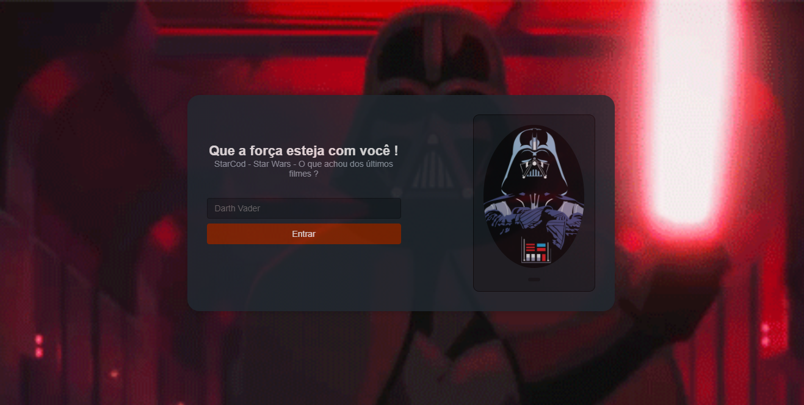

<h1  align="center">StarCod</h1>

<h2 align="center">
   StarCod. Chat para a discussão sobre Star Wars, novos filmes, séries e Gibis/HQS.
</h2>

 

    
Tecnologias utilizadas: 
    
    
    
    

 

    <h2>Imagem da Home Page do StarCod !</h2>  
    

 

<h2 align="center">Click aqui para acessar o site hospedado no GitHub Pages: <a href="https://star-cod-ricardosantanaevangelista.vercel.app">Site</a></h2>

<h2 align="center">Em processo de implementação !</h2>
    
